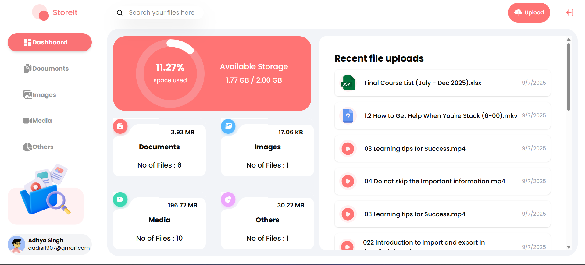
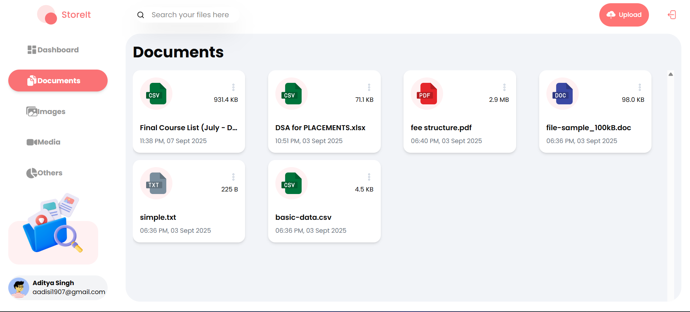
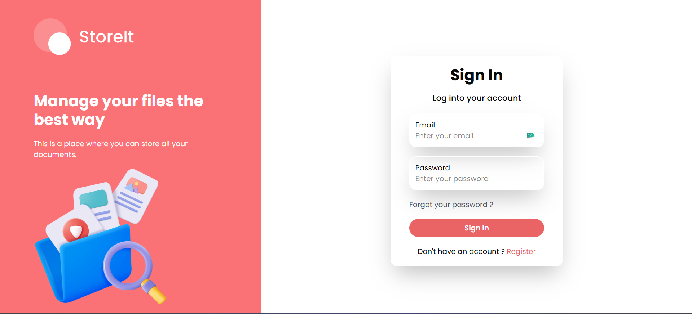

# ☁️ StoreIt

StoreIt is a full-stack cloud storage platform (similar to Google Drive) where users can securely upload, store, manage, and access their files anytime, anywhere.

---

## 🚀 Features
- 🔑 Authentication – Secure signup & login with MongoDB (JWT-based).
- 📂 File Storage – Upload, download, and delete files via Supabase Storage.
- ⚛️ Frontend – Built with React + Redux for smooth UI and state management.
- 🌐 Backend API – REST API with Node.js & Express.
- 🔍 File Management – Organized dashboard to view all uploaded files.
- 📱 Responsive UI – Works across desktop & mobile.

---

## 🛠️ Tech Stack

### Frontend
- React
- Redux Toolkit
- Axios

### Backend
- Node.js
- Express.js
- MongoDB (Mongoose)

### Cloud Storage
- Supabase (Storage service for files & images)

---

## 📂 Project Structure

StoreIt/  
│── client/             # React + Redux frontend  
│   ├── src/  
│   │   ├── components/ # Reusable UI components  
│   │   ├── pages/      # Dashboard, Auth, etc.  
│   │   ├── redux/      # Redux slices & store  
│   │   └── App.js  
│── server/             # Node.js + Express backend  
│   ├── models/         # MongoDB schemas  
│   ├── routes/         # API routes  
│   ├── controllers/    # Business logic  
│   ├── middleware/     # Auth, error handling  
│   └── server.js  
│── .env                # Environment variables  
│── package.json  
│── README.md  

## Create .env file inside server/:
PORT=5000
MONGO_URI=your-mongodb-uri
JWT_SECRET=your-secret-key
SUPABASE_URL=your-supabase-url
SUPABASE_KEY=your-supabase-key

## Start backend:
npm start

## Frontend Setup:
cd client
npm install
npm run dev

## 🚀 Usage

Register or login with your account.

Upload files to Supabase Storage.

Manage files in the dashboard (view/download/delete).

Access files securely from anywhere.

## 📸 Screenshots:

### Dashboard

### Documents

### Login

## 🌍 Live Demo
https://store-it-frontend.onrender.com/home

